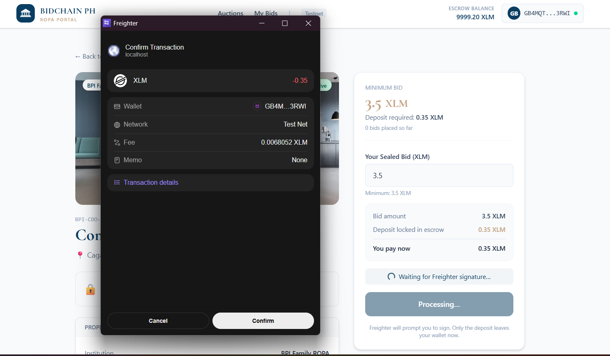
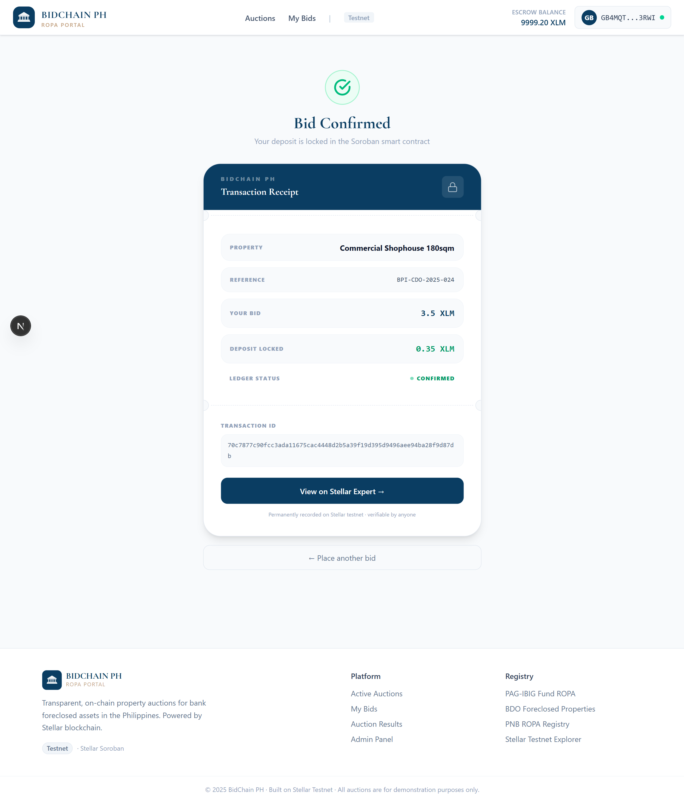
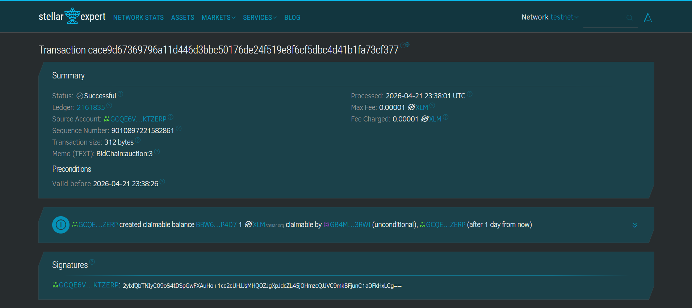
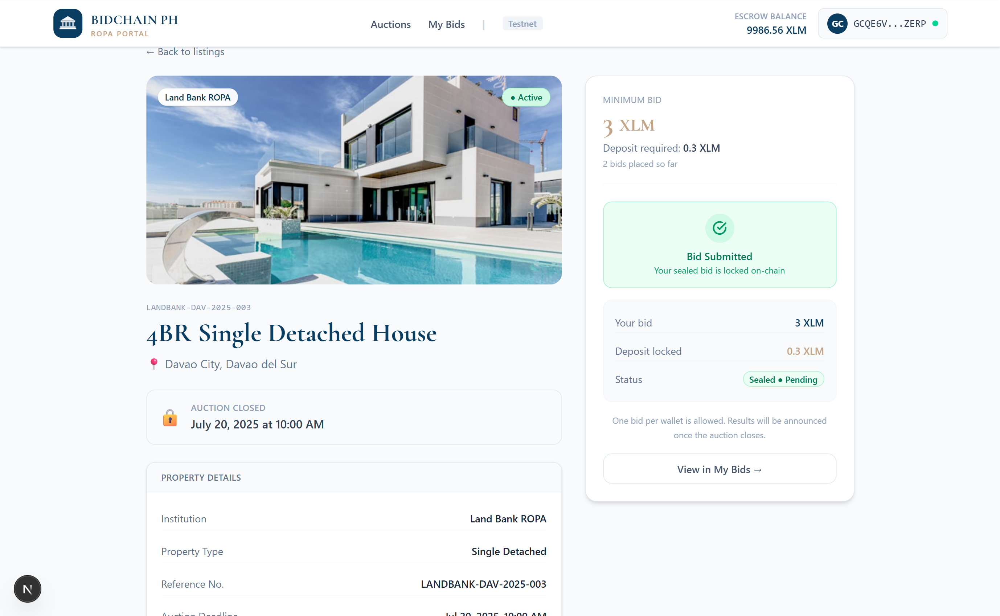
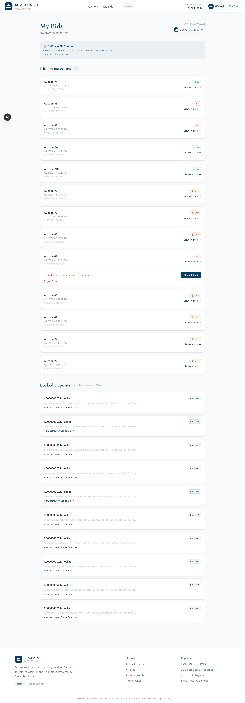
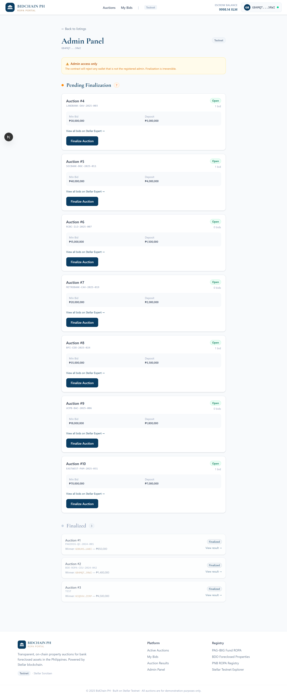
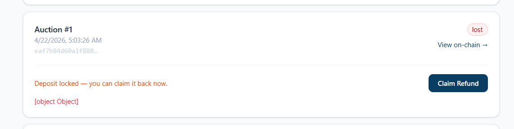
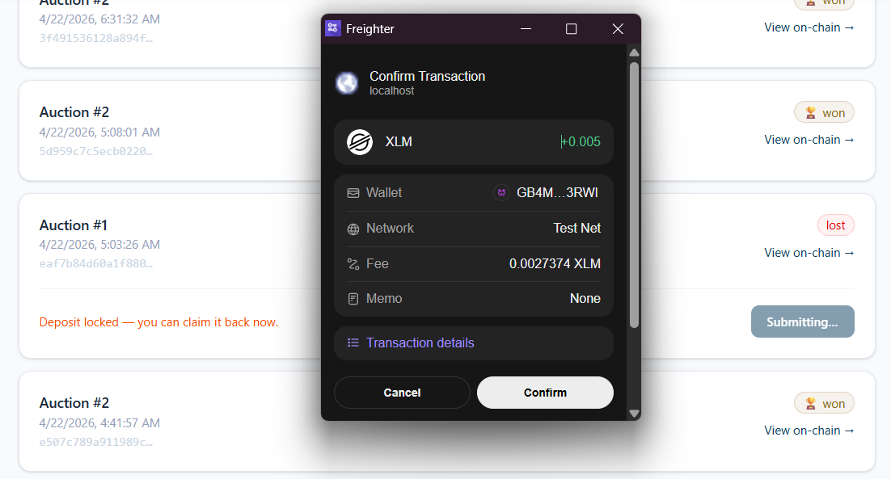
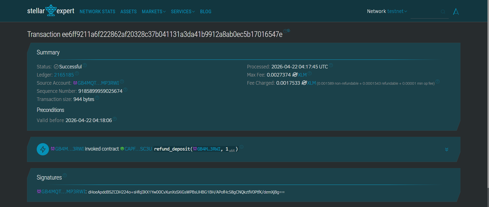

# BidChain PH — ROPA Auction Portal

> **Ending the Liquidity Trap:** Trustless on-chain bidding for foreclosed properties in the Philippines. Bid deposits locked on Stellar, winners declared by smart contract, results verifiable by anyone.

🔗**Live Demo**: https://bidchain-stellar.vercel.app/ \
🔗**Smart Contract**: https://stellar.expert/explorer/testnet/contract/CAPFAF6VMQK6X4HAVHLYRIOZMJLM56A3247N4K6EIKWYIDQMF4Y6SC3U

# 🚨 The Problem
A minimum-wage earner in Quezon City finds a PAG-IBIG foreclosed condo listed at ₱800,000—an opportunity for affordable homeownership.

But the current system is designed to fail him:

- **The Check Barrier:** Registration requires a physical manager's check. Bank fees, physical travel, and delays that most working Filipinos cannot manage.
- **The Liquidity Trap:** If the bidder loses, their deposit is held for 2 to 4 weeks before being refunded. Money they can't use for rent, other bids, or emergencies.
- **The Trust Gap:** Auctions happen behind closed doors with no public record and no way to verify the winner was chosen fairly.

# 💡 The Solution

BidChain PH moves the auction process on-chain using the Stellar blockchain.

- **Wallet-based bidding** via Freighter — no manager's check, no bank visit
- **Deposit locked in Soroban escrow** — funds are transferred into the smart contract and held until the auction is finalized
- **Auction results on-chain** — winner declared by a Soroban smart contract, verifiable by anyone
- **In-app refunds** — losing bidders can reclaim their deposit directly from the dashboard after finalization
- **Transparent bid history** — every transaction is permanently recorded on Stellar

# 🖥️ UI Screenshots

### Homepage


### Property Detail: Bid Panel


### Freighter Signature


### Transaction Receipt




### Closed Auctions Results


### My Bids Dashboard


### Admin Page


### Refund Sample




# 🧭 How to Use the App

1. Install the [Freighter browser extension](https://freighter.app) and switch it to **Testnet**
2. Fund your testnet wallet via [Stellar Friendbot](https://friendbot.stellar.org)
3. Browse active auctions on the homepage
4. Open a property listing and enter your bid amount
5. Click **Place Bid** — Freighter will prompt you to sign
6. A transaction receipt appears with your bid details and an on-chain verification link
7. Check closed auction results under the **Closed Auctions** section

# 🏗️ Architecture

```
Browser (Next.js + Tailwind)
        ↓
Freighter Wallet Extension
(signs transactions locally — keys never leave the browser)
        ↓
Stellar Testnet (Horizon API + Soroban RPC)
        ↓
┌──────────────────────────────────────────────────────┐
│              Soroban Smart Contract                  │
│  place_bid → deposit held in contract escrow         │
│  finalize_auction → declares winner                  │
│  refund_deposit → returns deposit to losing bidder   │
└──────────────────────────────────────────────────────┘
```

- **Bid deposits** are transferred into the Soroban contract via `place_bid` — locked in on-chain escrow
- **Auction logic** (create, finalize, cancel, refund) runs entirely in the deployed Soroban smart contract
- **Auction results** are read directly from the contract via Soroban RPC
- **Wallet** signs every transaction locally; the frontend only handles UI and state

# 📦 Smart Contract Functions

| Function | Caller | What It Does |
|---|---|---|
| `create_auction` | Admin | Lists a foreclosed property for auction |
| `place_bid` | Bidder | Records a bid on-chain (contract layer) |
| `finalize_auction` | Admin | Declares winner, issues purchase token |
| `refund_deposit` | Losing bidder | Releases deposit after finalization |
| `cancel_auction` | Admin | Cancels auction, enables all refunds |
| `get_auction` | Anyone | Read-only auction state |
| `get_bid` | Anyone | Read-only bid details |


# ✅ What's Working in This Demo

| Feature | Status |
|---|---|
| Browse active & closed property listings | ✅ Working |
| Search and filter properties | ✅ Working |
| Connect Freighter wallet | ✅ Working |
| Place a bid (locks deposit in Soroban contract escrow) | ✅ Working |
| Transaction receipt with on-chain verification link | ✅ Working |
| View auction result pulled from Soroban contract | ✅ Working |
| My Bids dashboard (transaction history from Stellar) | ✅ Working |
| Admin panel — finalize auction & declare winner | ✅ Working |
| In-app deposit refund for losing bidders | ✅ Working|


# 📁 Repo Structure

```
bidchain-stellar/
├── contract/
│   └── src/
│       ├── lib.rs          ← Soroban smart contract (Rust)
│       └── test.rs         ← 3 passing contract tests
├── frontend/
│   ├── app/
│   │   ├── page.tsx        ← Homepage — property listings
│   │   ├── property/[id]/  ← Property detail + bid form
│   │   ├── auction/[id]/   ← Auction result page
│   │   ├── dashboard/      ← My Bids + deposit history
│   │   └── admin/          ← Admin panel — finalize auctions
│   ├── components/
│   │   └── Navbar.tsx
│   ├── hooks/
│   │   └── useFreighter.ts ← Wallet connection hook
│   └── lib/
│       ├── stellar.ts      ← Blockchain interaction layer
│       └── mockData.ts     ← Property listings data
└── README.md
```

# 🔮 Future Improvements

- Real PAG-IBIG property data integration
- AI-assisted listing extraction from uploaded documents
- Mobile wallet signing support
- USDC deposit support alongside XLM
- Notification system for outbid and auction close events