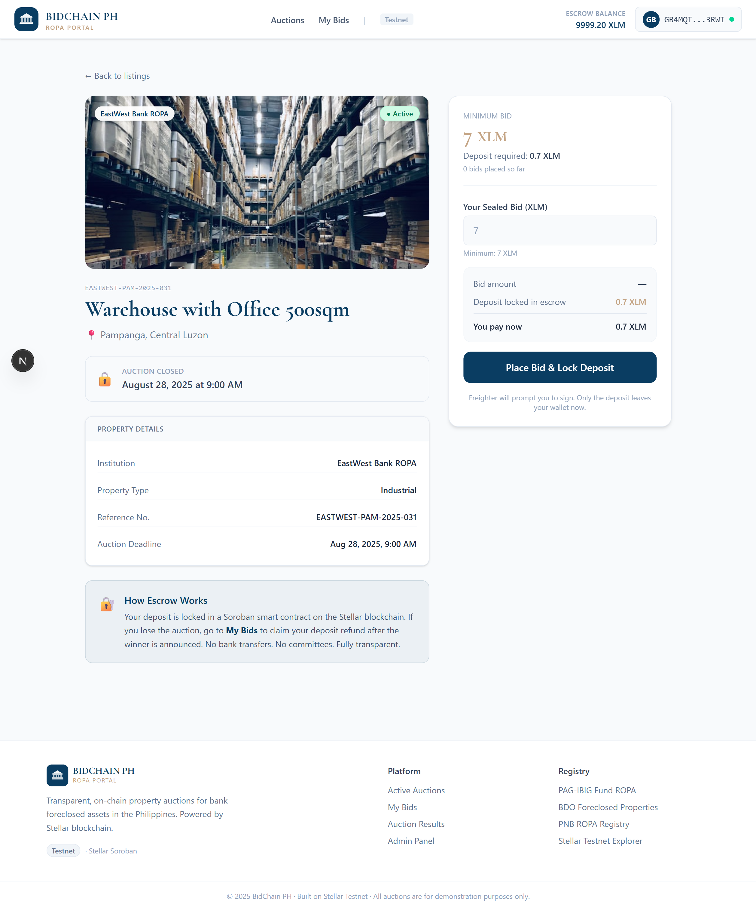
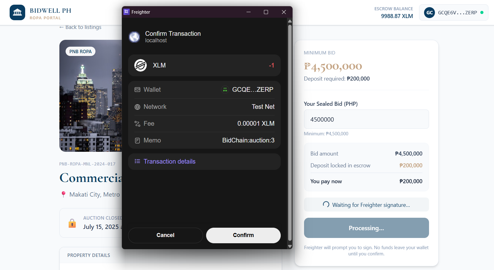
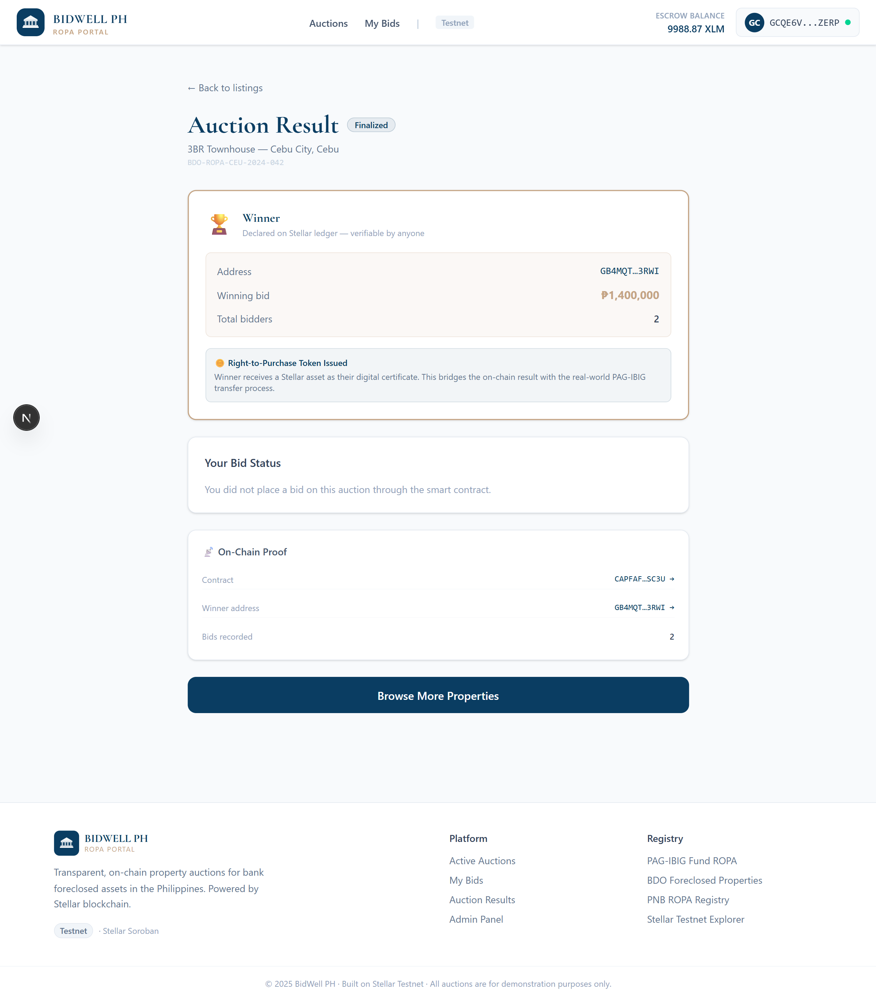
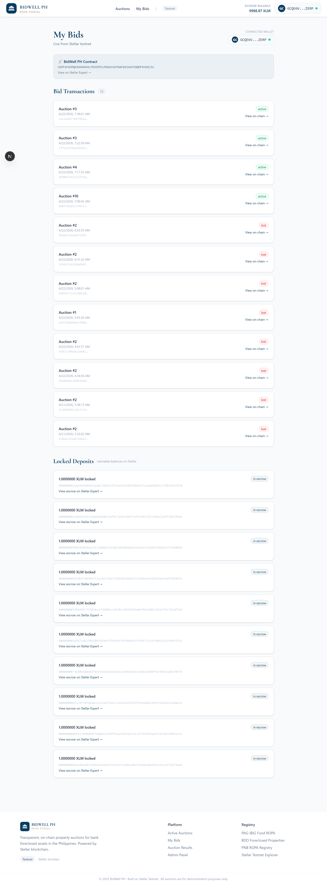

# BidChain PH — ROPA Auction Portal

> **Ending the Liquidity Trap:** Trustless on-chain bidding for foreclosed properties in the Philippines. Bid deposits held in Soroban escrow, winners selected by code, and losers refunded in seconds—not weeks.

🔗**Live Demo**: https://bidchain-stellar.vercel.app/ \
🔗**Smart Contract**: https://stellar.expert/explorer/testnet/contract/CAPFAF6VMQK6X4HAVHLYRIOZMJLM56A3247N4K6EIKWYIDQMF4Y6SC3U

# 🚨 The Problem
A minimum-wage earner in Quezon City finds a PAG-IBIG foreclosed condo listed at ₱800,000—an opportunity for affordable homeownership.

But the current system is designed to fail him:

- The Check Barrier: Registration requires a physical manager's check. This means bank fees, physical travel, and delays that most working Filipinos cannot manage.
- The Liquidity Trap: If the bidder loses, their deposit is held for 2 to 4 weeks before being refunded. This prevents them from using the funds for other urgent needs or new opportunities.
- The Trust Gap: Auctions are conducted manually, with limited public visibility. There is no real-time, verifiable record of bids or outcomes.

As a result, many potential buyers opt out of the process, and properties remain unclaimed or underutilized.

# 💡 The Solution
BidChain PH moves auctions on-chain using Stellar smart contracts.

- Wallet-based bidding (Freighter)
- Instant deposit locking via smart contract
- Automatic refunds for losers
- Transparent, verifiable auction results

# 🖥️ UI Screenshots

### Homepage


### Property Detail: Bid Panel


### Freighter Signature


### Transaction Receipt


### Closed Auctions Results


### My Bids Dashboard


# 🧭 How to Use the App

1. Install Freighter and switch to Testnet  
2. Browse active auctions  
3. Open a property listing  
4. Place a bid (sign via Freighter)  
5. View transaction receipt  
6. Check results in closed auctions  
7. Claim refund if eligible  

# 🏗️ Architecture

Frontend (Next.js)
↓
Freighter Wallet
↓
Soroban Smart Contract (Stellar Testnet)

- Smart contract handles bidding logic
- Wallet signs transactions locally
- Frontend only handles UI + state

# 📦 Contract Functions

- create_auction
- place_bid
- finalize_auction
- refund_deposit
- get_auction

## 📁 Repo Structure

```
bidchain-stellar/
├── contract/
│   └── src/
│       ├── lib.rs          ← Soroban smart contract (Rust)
│       └── test.rs         ← 3 passing contract tests
├── frontend/
│   ├── app/
│   │   ├── page.tsx        ← Homepage — property listings
│   │   ├── property/[id]/  ← Property detail + bid form
│   │   ├── auction/[id]/   ← Auction result page
│   │   ├── dashboard/      ← My Bids + refund flow
│   │   └── admin/          ← Admin panel — finalize auctions
│   ├── components/
│   │   └── Navbar.tsx
│   ├── hooks/
│   │   └── useFreighter.ts ← Wallet connection hook
│   └── lib/
│       ├── stellar.ts      ← Blockchain interaction layer
│       └── mockData.ts     ← Property listings data
└── README.md
```

# 🔮 Future Improvements

- Real PAG-IBIG property integration
- AI-assisted listing extraction
- Mobile signing improvements
- USDC support
- Notification system