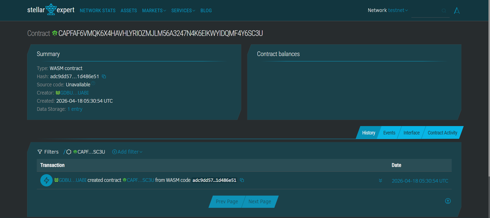

# BidChain

> **Ending the Liquidity Trap:** Trustless on-chain bidding for foreclosed properties in the Philippines. Bid deposits held in Soroban escrow, winners selected by code, and losers refunded in seconds—not weeks.

---

## Project Name
**BidChain**

---

## The Problem: The "Freezer" Effect

A minimum-wage earner in Quezon City finds a PAG-IBIG foreclosed condo listed at ₱800,000—a rare path to homeownership he can actually afford.

But the current system is designed to fail him:

- The Check Barrier: Registration requires a physical manager's check. This means bank fees, physical travel, and delays that most working Filipinos cannot manage.
- The Liquidity Trap: If he loses the bid, his deposit is frozen for 2 to 4 weeks. He cannot use that money for his family, nor can he bid on a different property.
- The Trust Gap: Auctions happen behind closed doors. There is no public ledger to prove the result wasn't manipulated by a human committee.

The result? The bidder gives up, and the property sits empty.

---

## Solution

BidChain replaces the four "broken" parts of the auction process with Stellar-native primitives:
- Trustless Escrow: Bidders lock deposits directly into a Soroban Smart Contract via Freighter wallet. No manager's checks, no bank visits.
- On-Chain Verification: Every bid is an immutable transaction on the Stellar ledger. Anyone can verify the auction history, ensuring 100% transparency.
- Instant Finality: Leveraging Stellar’s 5-second ledger close, losing bidders are refunded instantly the moment the auction ends. Their capital is never "trapped."
- Right-to-Purchase Token: The winner receives a minted asset—a digital certificate of the win—to bridge the on-chain result with the real-world legal transfer at PAG-IBIG.

---

## Vision and Purpose

Every day, affordable foreclosed properties sit unsold while regular Filipinos who could afford them are locked out by a broken process. BidChain does not replace PAG-IBIG or the legal property transfer process. It replaces the four broken parts: the deposit, the bidding, the winner selection, and the refund. Everything else stays the same. The goal is to make foreclosed property auctions as open, fair, and accessible as buying something on Shopee.

---

## Contract Address
CAPFAF6VMQK6X4HAVHLYRIOZMJLM56A3247N4K6EIKWYIDQMF4Y6SC3U


## Suggested Timeline for MVP Delivery

| Day | Milestone |
|---|---|
| Day 1 | Soroban contract written, compiled, 3 tests passing |
| Day 2 | Contract deployed to Stellar testnet |
| Day 3 | Frontend scaffolded — auction listing page, bid form |
| Day 4 | Freighter wallet integration, fund_bid wired to contract |
| Day 5 | Finalize auction UI, refund flow, purchase token display |
| Day 6 | Full demo flow tested end-to-end, README finalized |
| Day 7 | Screenshots added, Rise In submission submitted |

---

## Stellar Features Used

| Feature | Usage |
|---|---|
| Soroban smart contracts | Bid deposit escrow, winner selection, refund logic, purchase token issuance |
| XLM / USDC transfers | Token-based deposit lock and instant refund settlement |
| Custom tokens | Right-to-purchase token issued to the winning bidder on auction close |
| Trustlines | Winner must hold a trustline for the purchase token before it can be received |
| On-chain events | Frontend tracking of bid, winner, refund, and cancel state changes |

---

## Contract Functions

| Function | Caller | Description |
|---|---|---|
| `initialize(admin)` | Deployer | Sets admin address, resets auction counter |
| `create_auction(admin, property_ref, min_bid, deposit, token, deadline)` | Admin | Lists a foreclosed property for auction |
| `place_bid(bidder, auction_id, bid_amount)` | Bidder | Locks deposit and records bid on-chain |
| `finalize_auction(admin, auction_id, winner, purchase_token_hash)` | Admin | Declares winner, issues purchase token |
| `refund_deposit(bidder, auction_id)` | Losing bidder | Claims deposit refund after finalization |
| `cancel_auction(admin, auction_id)` | Admin | Cancels auction, enables all refunds |
| `get_auction(auction_id)` | Anyone | Read-only auction state |
| `get_bid(auction_id, bidder)` | Anyone | Read-only bid state |
| `get_auction_count()` | Anyone | Total auctions created |
| `get_purchase_token(auction_id)` | Anyone | Right-to-purchase token hash for winner |

---

## Auction Lifecycle

```
Open
  → Finalized  (admin calls finalize_auction — winner declared, purchase token issued)
  → Cancelled  (admin calls cancel_auction — all deposits become refundable)

After Finalized or Cancelled:
  → Each losing bidder calls refund_deposit to claim instantly
```

---

## Why BidChain Wins

BidChain targets a problem every Filipino judge either knows personally or has a family member who does — the broken PAG-IBIG foreclosed property auction process that favors connected buyers and freezes regular people's money for weeks. Stellar's sub-cent fees and 5-second finality make trustless deposit escrow viable even for small bids, a use case that no existing bank, GCash, or government portal can replicate. The right-to-purchase token bridges on-chain trust with the real-world legal property transfer, making this a practical, production-relevant project — not just a hackathon demo.

---

## Optional Edge — AI Integration

Integrate Gemini to analyze PAG-IBIG property listing documents uploaded by the admin and auto-extract key details — property reference, location, assessed value, minimum bid, encumbrances — and pre-fill the auction creation form. This reduces admin error, speeds up listing, and adds an AI layer that makes the product more compelling to non-technical government staff who would actually use it.

---

## Constraints

| Dimension | Selection |
|---|---|
| Region | SEA — Philippines (Metro Manila, Cebu, Davao) |
| User Type | Aspiring homeowners, OFWs bidding remotely |
| Complexity | Soroban required, Web app |
| Theme | Escrow for contracts + Transparent fund distribution |

---

## Prerequisites

- Rust (latest stable): https://rustup.rs
- WASM target: `rustup target add wasm32-unknown-unknown`
- Stellar CLI v22+: `cargo install --locked stellar-cli`
- Freighter browser extension (set to Testnet)
- Funded testnet account via Friendbot: https://friendbot.stellar.org

---

## Build

```bash
stellar contract build
```

Compiled WASM output:
```
target/wasm32-unknown-unknown/release/bidchain.wasm
```

---

## Test

```bash
cargo test
```

Expected output:
```
running 3 tests
test tests::test_happy_path_full_auction_flow ... ok
test tests::test_duplicate_bid_rejected ... ok
test tests::test_state_after_finalized_auction ... ok

test result: ok. 3 passed; 0 failed
```

---

## Deploy to Testnet

```bash
# 1. Generate and fund a deployer key
stellar keys generate --global deployer --network testnet
stellar keys fund deployer --network testnet

# 2. Deploy the contract
stellar contract deploy \
  --wasm target/wasm32-unknown-unknown/release/bidchain.wasm \
  --source deployer \
  --network testnet
```

Copy the contract ID from the output (starts with `C...`).

---

## Initialize the Contract

```bash
stellar contract invoke \
  --id <CONTRACT_ID> \
  --source deployer \
  --network testnet \
  -- initialize \
  --admin <ADMIN_ADDRESS>
```

---

## Sample CLI Invocations

### Create an auction (admin)
```bash
stellar contract invoke \
  --id <CONTRACT_ID> \
  --source admin \
  --network testnet \
  -- create_auction \
  --admin <ADMIN_ADDRESS> \
  --property_ref "PAGIBIG-QC-2024-001" \
  --min_bid 800000 \
  --deposit_amount 50000 \
  --token <TOKEN_CONTRACT_ID> \
  --deadline 1000
```

### Place a bid (bidder)
```bash
stellar contract invoke \
  --id <CONTRACT_ID> \
  --source bidder \
  --network testnet \
  -- place_bid \
  --bidder <BIDDER_ADDRESS> \
  --auction_id 1 \
  --bid_amount 850000
```

### Finalize auction (admin)
```bash
stellar contract invoke \
  --id <CONTRACT_ID> \
  --source admin \
  --network testnet \
  -- finalize_auction \
  --admin <ADMIN_ADDRESS> \
  --auction_id 1 \
  --winner <WINNER_ADDRESS> \
  --purchase_token_hash 0101010101010101010101010101010101010101010101010101010101010101
```

### Claim refund (losing bidder)
```bash
stellar contract invoke \
  --id <CONTRACT_ID> \
  --source loser \
  --network testnet \
  -- refund_deposit \
  --bidder <BIDDER_ADDRESS> \
  --auction_id 1
```

### Read auction state
```bash
stellar contract invoke \
  --id <CONTRACT_ID> \
  --network testnet \
  -- get_auction \
  --auction_id 1
```

### Get purchase token (winner)
```bash
stellar contract invoke \
  --id <CONTRACT_ID> \
  --network testnet \
  -- get_purchase_token \
  --auction_id 1
```

---

## Verify on Stellar Expert

```
https://stellar.expert/explorer/testnet/contract/<CONTRACT_ID>
```

---

## Repo Structure

```
bidchain/
├── contract/
│   ├── src/
│   │   ├── lib.rs      ← Soroban smart contract
│   │   └── test.rs     ← 3 contract tests
│   └── Cargo.toml
├── frontend/
│   └── src/
│       ├── pages/
│       └── components/
├── assets/
│   └── (screenshots)
└── README.md
```

---